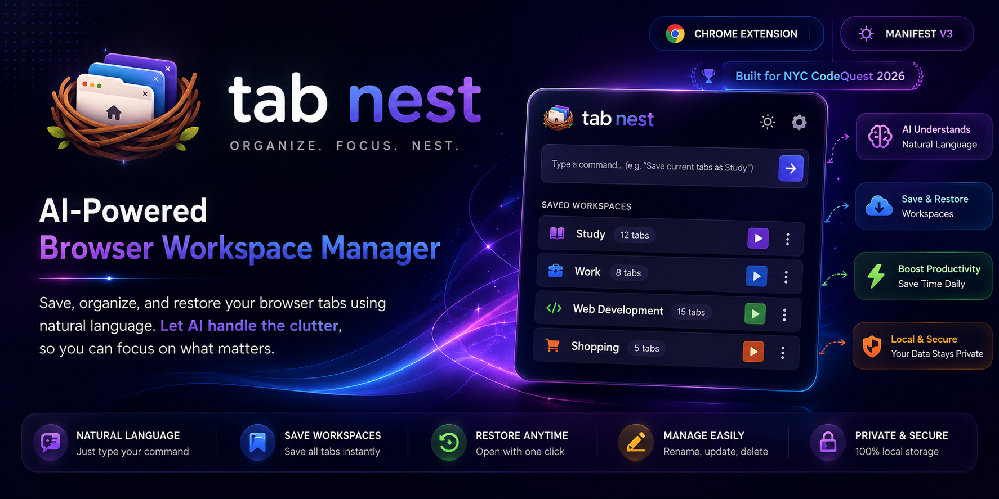
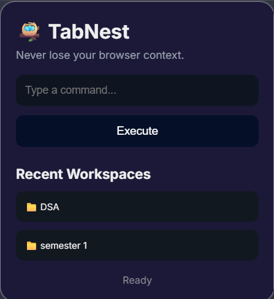
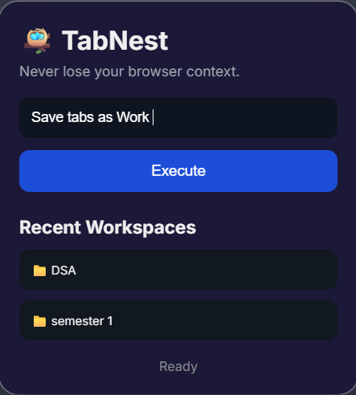
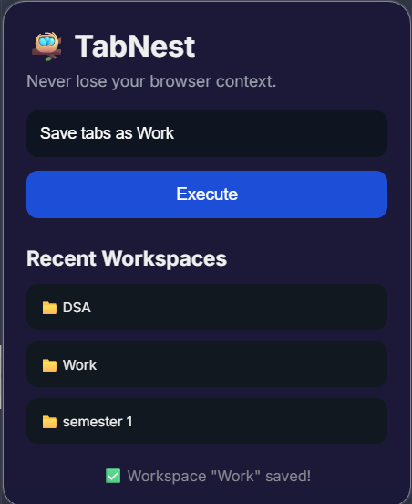

<p align="center">
  
</p>
<div align="center">

# 🪺 TabNest

### 🚀 AI-Powered Browser Workspace Manager

#### Save • Organize • Restore Browser Workspaces Using Natural Language

<p>
  
  
  
  
  
</p>

### 🌟 Built with AI to make browser workspace management effortless.

</div>

---

# 📚 Table of Contents

- [📖 About](#-about)
- [💡 Why TabNest?](#-why-tabnest)
- [✨ Features](#-features)
- [🛠 Tech Stack](#-tech-stack)
- [⚙️ How It Works](#️-how-it-works)
- [📸 Screenshots](#-screenshots)
- [🎥 Demo](#-demo)
- [📂 Project Structure](#-project-structure)
- [🚀 Installation](#-installation)
- [💬 Example Commands](#-example-commands)
- [🗺 Future Roadmap](#-future-roadmap)
- [🙏 Acknowledgements](#-acknowledgements)
- [📄 License](#-license)

---

# 📖 About

TabNest is an **AI-powered Chrome Extension** that allows users to save, organize, update, and restore browser workspaces using simple natural language commands.

Instead of manually creating bookmarks or remembering dozens of tabs, simply type commands like:

```text
Save current tabs as Study

Open Study

Rename Study to Semester 1

Delete Shopping

Add current tabs to Study
```

TabNest understands the user's intent using **Google Gemini AI** and performs the requested action automatically.

---

# 💡 Why TabNest?

Managing browser tabs becomes difficult when working on multiple projects, studying different subjects, or researching online.

Closing Chrome or restarting a laptop often results in losing an entire workflow.

Traditional bookmarks save only individual websites—not complete workspaces.

**TabNest solves this by allowing users to save and restore complete browser sessions using natural language.**

---

# ✨ Features

| 🚀 Feature | Description |
|------------|-------------|
| 🤖 AI Natural Language Commands | Understands commands using Google Gemini |
| 💾 Save Workspace | Save all currently opened tabs |
| 🚀 Restore Workspace | Instantly reopen saved workspaces |
| ✏️ Rename Workspace | Rename saved workspaces anytime |
| 🗑 Delete Workspace | Remove unnecessary workspaces |
| ➕ Update Workspace | Add current tabs to existing workspaces |
| 📋 Workspace Manager | View all saved workspaces |
| 🚫 Duplicate Prevention | Avoid duplicate tabs while updating |

---

# 🛠 Tech Stack

| Category | Technologies |
|----------|--------------|
| Frontend | HTML5 • CSS3 • Vanilla JavaScript |
| Browser APIs | Chrome Tabs API • Chrome Storage API |
| Extension | Chrome Extension Manifest V3 |
| Artificial Intelligence | Google Gemini API |

---

# ⚙️ How It Works

```text
          👤 User

             │

             ▼

   Natural Language Command

             │

             ▼

      Google Gemini AI

             │

             ▼

      Structured JSON Output

             │

             ▼

      Command Processing

             │

             ▼

 Chrome Tabs API + Storage API

             │

             ▼

 Workspace Saved / Opened
```

---

# 📸 Screenshots

<div align="center">

| Home | AI Command |
|:----:|:----------:|
|  |  |

| Output |
|:------:|
|  |

</div>

# 🎥 Demo

<div align="center">

## 📺 Watch TabNest in Action

[](https://youtube.com)

[](https://youtube.com)

</div>

> 🚧 Demo videos will be uploaded to YouTube shortly after submission.

---

# 📂 Project Structure

```text
TabNest/
│
├── manifest.json
├── popup.html
├── popup.css
├── popup.js
├── tabs.js
├── storage.js
├── ai.js
│
├── icons/
│
├── README.md
│
└── assets/
```

---

# 🚀 Installation

### 1️⃣ Clone the repository

```bash
git clone https://github.com/kuhit-digitals/TabNest.git
```

### 2️⃣ Open Chrome

```
chrome://extensions
```

### 3️⃣ Enable **Developer Mode**

### 4️⃣ Click **Load unpacked**

### 5️⃣ Select the project folder

### 6️⃣ Add your Google Gemini API Key inside

```
ai.js
```

### 7️⃣ Start using TabNest 🚀

---

# 💬 Example Commands

```text
Save current tabs as Study

Open Study

Rename Study to Semester 1

Delete Semester 1

Add current tabs to Study

Save current tabs as Web Development

Open Web Development
```

---

# 🗺 Future Roadmap

- ☁️ Cloud Synchronization
- 📤 Import / Export Workspaces
- 🔍 Workspace Search
- 🤖 AI Workspace Suggestions
- 🎤 Voice Commands
- ⌨️ Keyboard Shortcuts
- 👥 Workspace Sharing
- 🌐 Cross-Browser Support

---

# 🙏 Acknowledgements

This project was developed for **NYC CodeQuest 2026**.

Special thanks to:

- 💙 Google Gemini API
- 🌐 Chrome Extension APIs
- 🚀 NYC CodeQuest Organizers

for providing the opportunity to build innovative solutions.

---

# 📄 License

This project was created for educational and hackathon purposes as part of **NYC CodeQuest 2026**.

---

<div align="center">

## ⭐ If you enjoyed this project, consider giving it a Star!

### Made with ❤️ by **Phoenix Forge**

*"Forging Ideas Into Reality."*

🚀 NYC CodeQuest 2026

</div>